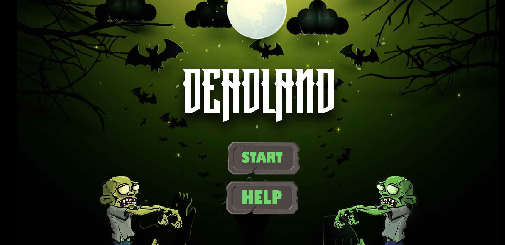

# Google Summer Of Code(GSoC2022) - Catrobat
## Awesome Demo Game Project : Deadland

An Awesome Demo Game which is playable on both phones as well as on smart TV when cast made in Catrobat Visual Programming Language. The game is ispired with many Zombie based ames like Zombieville. The main character of the game is 'Mark'  who is the hero and has ability to save the whole city with this destruction. At each level, Mark will fight with Zombies and creatures sent by the main villain 'Goliath'. and In the last level Mark will fight with our main Villain 'Goliath' and defeat him and save the city with this disaster by ejecting the antidode. The player follows mark in his journey. The game story is easily depicted through cinematic cutscenes for better insight. The game is very easy to play and get into, with on-screen controls, and a fairly simple UI. The game is playable on both phones and on a smart TV without looking at the phone's screen while using the phone as a gamepad. This game shows how the ‘Pocket Code’ app can be used to develop high-quality video games if used efficiently and effectively.

Game Youtube video- 

Thanks to Mentors:  
Vaibhav anand and Yash punia for their support throughout the Gsoc period.

## About Game
"DEADLAND” is a classically styled 2D action adventure game, it has 5 different level, In every level you will face the hurdles and fight with the Zombies to reach the final in order to save the city. Throughout the game you will get health vial and power to reach to final level and In the final level you will get the grenades to fight the main Villains.

## Game Story
Once upon a time in the city of mexico there happened an insane attack by Goliath, he spread the posinous gas in almost whole city and infected many human beings but there was a special guy called Mark who was the part some scientific experiment because of which he was immune to gases such that the gas would not affect him so now he is the only one who can save the city from this disaster by spreading antidode in the city with the help of Ganali device. The whole story is revolving around our main character Mark. But to reach to the Ganali deviceis not easy, there are many Zombies and monsters on his way to stop doing this, but mark has to fight them with help of guns he has. eventually he will get grenades also. Now as the level increases the difficulty level for Mark also increases. And at the end level when he gets very near to Ganali device there comes our main villian named Goliath. He is the one who is responsible for this disaster and made the world like this. Now Mark has to give him a tough fight in order to eject the antidode in Ganali device.
And when this happened our city will be free from all the zombies and monsters.
All people can start their normal life again, and our hero mark also gets famous.the player follows mark’s journey The game story is easily depicted through cinematic cutscenes for better insight.The game will be very easy to play and get into with the on screen controls and a fairly simple UI, this game shows how pocket code app can be used to develop high quality video games. If we used effectively.

## What I planned
While going through the Idealist of catrobat I found Awesome demo game project which I thought to fit with my skills and interest. I have always like to play games and thinking how it was made. and there are many zombie games I played which inspires me to make such game on the Pocket Code app through the Awesome Demo Game Project. After getting selected in GSoC 2022 for this project, I started working on the Game Design, including story development and game progression. I finalized the game story with the help of my mentors. Pocket Code provides the perfect tools to express my ideas and with the help of it, I wanted to showcase how the app could be used to create big game-projects. Pocket Code has functionalities like storing the data locally on a device, which can be utilized to create such good games. The feeling of isolation, adventure, and the curiosity to explore game-worlds helped me solidify the game aesthetics and design. I really enjoyed my whole GSoc journey, at first I struggled with the code base of catrobat but then I get comfortable.

### What I experienced throughout the journey
* At first, when I started working on the game, I was literally struggling to understand the code base of catrobat, because I have worked upon small projects before but this is my first big gaming project on catrobat.
* In the bonding period, I decided to design the character and make the level baseline first with discussing with my mentor, I spent a good amount of time to find good vector art and creating proper levels in a 2D scenario.
* The next problem I faced was the lagging, when I was making the game I faced a lot lag in the game like it can't playable then I reduced it upto many extent by removing some loops and reducing asstes and improving logics etc. 
* Another problem is the Art style, I am working on vector art style but somehow my assets are not matching with the levels and background that I was using. so I tried making some of my own.
* The next major problem I faced was to implement proper player collisions behaviour. The physics I used for the game initially had some small glitches, but I could not overlook them. So I worked on improving and polishing the physics of the game. It took me a while but I figured it out after discussions with the mentor.
* The aiming logic problem, at first I was building the game without the aimer but then I changed the controls system fully and introduce a aimer which will help help mark to aim target and then shoot. the aimer is looking very good in the game but it also genetrates issues like lagging because it require a good logic to boild it, so at the end I again removed the aimer and get back to the normal controls
* Uploading my project file to the Pocket Community. After completing my project in the third version, I thought my game size is big so it will generate problems and it does. After discussing it with the mentors, I got a hint that my project file had some unused assets and infinite loops, so figured it out and now it is uploaded successfully. Right now the game is playable through the project file available through the latest releases.

### Contributing to the Project
The project files created during this summer are present on the catrobat server along with versions:  
Version-3 : https://share.catrob.at/app/project/b258fd76-6cb5-44b7-80cf-f5e587d572d9   
Version-2 : https://share.catrob.at/app/project/ff8dd62e-7e9c-45a5-a724-d84713209a8f  
Version-1 : https://share.catrob.at/app/project/a193483a-8c9f-4162-acaf-a6bf4212a5c1  
Version-0 : https://share.catrob.at/app/project/27662024-5081-4478-845c-9b0b9b2215af  
All the project files, along with the amount of content they hold, are in the “Project Summaries” document in the directory. All the assets and music files are present in above github repository. The(.catrobat) file can be imported into your Pocket Code app.
Download the desired project file and remix it as you want! 
Game link(https://share.catrob.at/app/project/b258fd76-6cb5-44b7-80cf-f5e587d572d9)
